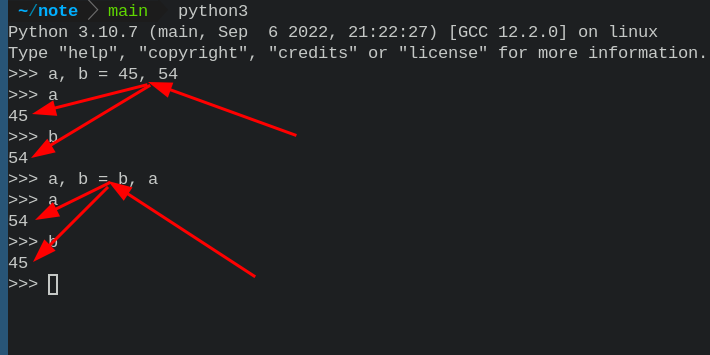

- #### Use Vimium
    - `d` # Down
        - `Space` # In Chromium
    - `yy` # Copy the current URL to the clipboard
        - `C-l C-c` # In Chromium
    - `f` # Feature
        - And then press capital leters
        - Will open a link in a new tab
- ***Notes***
    - `?` # Help
    - Needs
        - hover
- ***References***
    - https://github.com/philc/vimium#keyboard-bindings
    - https://support.google.com/chrome/answer/157179?hl=en&co=GENIE.Platform%3DDesktop#zippy=%2Ctab-window-shortcuts%2Cgoogle-chrome-feature-shortcuts%2Caddress-bar-shortcuts%2Cwebpage-shortcuts%2Cmouse-shortcuts
- ---
- `print("{:5} {:7.2f}".format(fahrenheit, celsius))` 含义
  * `:5` # 5 个字符宽度
  * `.2f` # 四舍五入到小数点后两位
  * `:7.2f` # 7 个字符宽度，四舍五入到小数点后两位
  * 
- [[python]] tuple (元组) # 在一行内定义多个变量
  * `a, b = 45, 54` # 将值 45 分配给变量 a; 将值 54 分配给变量 b
  * ***注意事项***
  * 用 `,` (逗号) 来创建 tuple (元组)
  * 也可用于交换值(如下图所示)
  * 
- [[linux]] `cp 文件 目录` # 注意事项：若目录存在此同名文件，将会覆盖此同名文件
-
