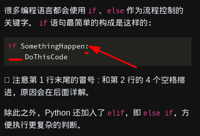
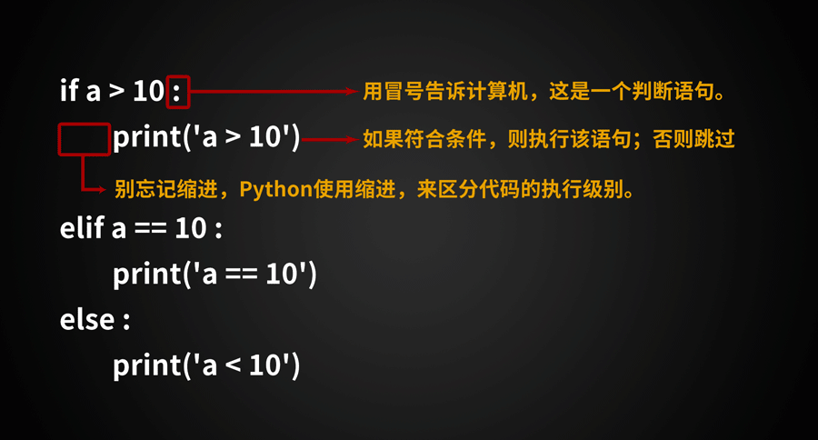
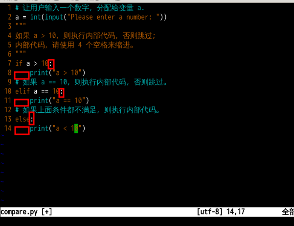
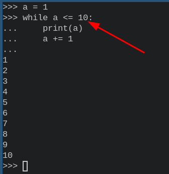

- ***Python_的流程控制***
  * ***Python_文件的创建和执行***
      * `vim test.py` # 用 vim 打开 test.py 文件 (若没有 test.py 文件，则创建并打开 test.py 文件)
      * `python3 test.py` # 用 python3 interpreter (解析器) 执行 test.py 文件
      * 
  * ***流程控制*** # 告诉计算机什么时候该干什么事
  * ***条件判断***
      * 
      * 注意第一行的 `:` (冒号)；第二行的 `space` (空格) (4个空格作为一个缩进)
      * `else` `elif` # `elif: else if` (用来执行更复杂的)
  * ***比较大小游戏***
      * 
      * 
  * ***更多判断***
      * ***嵌套***
      * 
      * ***结合 and 和 or***
      * 
  * ***循环控制*** # 实现功能：重复和自动
      * ***for 循环***
      * 
      * `for` # `for` (对于)
      * `in` # `in` (在……之中)
      * `item` # `item` (每个元素) (你可以自定义，如果你喜欢的话)
      * `for i in namelist` # 对于在 namelist 中的每个元素 (i) 执行从属代码
      * 
      * 
      * ***range() 函数***
      * ***range(x)***
          * `range(10)` # 生成 10 (`x`) 个整数 (从 0 开始)
          * 
      * ***range(a, b)***
          * `range(1, 11)` # 生成 11 - 1 (`b - a`) 个数 (从 1 (`a`) 开始)
          * 
      * ***while 循环***
          * 
          * `while` # `while` (当……时)
          * `while a <= 10:` `while` (当……时) (当 a <= 10 时，执行从属代码，否则循环停止)
          * 
          * 
  * ***区别 (for 循环与 while 循环)***
      * 
      * ***break 和 continue***
      * ***break***
          * `break` # `break` (打破) (打破当前循环) (不会打破所有循环)
          * 
      * ***continue***
          * `continue` `continue` (继续) (继续循环的下一次迭代)
          * 
          * 
- [[Git]] 撤销 `git add .`
  * `git reset HEAD`
  * 
  * ***参考资料***
  * 
  * [git 如何取消 add 操作](https://blog.csdn.net/u011442726/article/details/94588440)
-