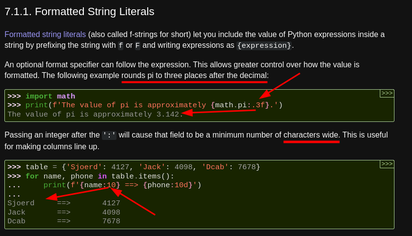

- vimium 使用
  * `J/K` # 上一个/下一个标签页 (相当于 `ctrl + tab` / `ctrl + shift + tab`)
  * `f/F` # 点击并跳转它至新页面/当前页面(显示快捷键) (相当于 `鼠标点击`)
  * `H/L` # 上一个/下一个页面 (相当于 `alt + left/right arrow`)
  * `r` # 刷新页面 (相当于 `ctrl + r`)
  * `j/k` # 向下/上滚动网页 (相当于 `space` / `shift + space`)
  * `yy` # 复制当前 URL 到剪贴板 (相当于 `ctrl + l` + `ctrl + c`)
  * `x` # 关闭当前标签页 (相当于 `ctrl + w`)
  * ***参考资料***
  * [vimium#keyboard-bindings](https://github.com/philc/vimium#keyboard-bindings)
  * [Chrome keyboard shortcuts](https://support.google.com/chrome/answer/157179?hl=en&co=GENIE.Platform%3DDesktop#zippy=%2Ctab-window-shortcuts%2Cgoogle-chrome-feature-shortcuts%2Caddress-bar-shortcuts%2Cwebpage-shortcuts%2Cmouse-shortcuts)
- `print("{:5} {:7.2f}".format(fahrenheit, celsius))` 含义
  * `:5` # 5 个字符宽度
  * `.2f` # 四舍五入到小数点后两位
  * `:7.2f` # 7 个字符宽度，四舍五入到小数点后两位
  * 
- [[python]] tuple (元组) # 在一行内定义多个变量
  * `a, b = 45, 54` # 将值 45 分配给变量 a; 将值 54 分配给变量 b
  * ***注意事项***
  * 用 `,` (逗号) 来创建 tuple (元组)
  * 也可用于交换值(如下图所示)
  * 
- [[linux]] `cp 文件 目录` # 注意事项：若目录存在此同名文件，将会覆盖此同名文件
-