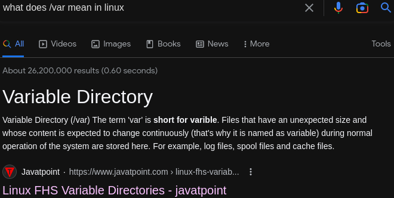

- ---
- #### The #abbreviation of `/var` is #variable in #Linux. #Idea
- ***References***
	- 
- ---
- #### Usage of [[ebuild repository]] in [[Gentoo Linux]]
	- `sudo eselect repository create test`
	- `sudo mkdir -p /var/db/repos/test/app-misc/logseq/`
	- `sudo vim /var/db/repos/test/app-misc/logseq/logseq-0.8.8.ebuild`
	- `sudo chown -R portage:portage /var/db/repos/test/`
	- `cd /var/db/repos/test/app-misc/logseq/`
	- `sudo pkgdev manifest`
	- `sudo emerge -aq app-misc/logseq`
- ***Notes***
	- `sudo eselect repository create test` # Create an empty ebuild repository named *test*
		- `sudo emerge -aq app-eselect/eselect-repository` # Install it if you don't have it
	- `sudo vim /var/db/repos/test/app-misc/logseq/logseq-0.8.8.ebuild` # Create the ebuild file named *logseq-0.8.8*
	  <details><summary>logseq-0.8.8.ebuild</summary>
	  ```
	  # Copyright 1999-2022 Gentoo Authors
	  # Distributed under the terms of the GNU General Public License v2
	  
	  EAPI=8
	  
	  inherit unpacker
	  
	  DESCRIPTION="A privacy-first, open-source platform for knowledge management and collaboration"
	  HOMEPAGE="https://logseq.com/"
	  SRC_URI="https://github.com/logseq/logseq/releases/download/${PV}/Logseq-linux-x64-${PV}.zip"
	  S="${WORKDIR}"
	  
	  LICENSE="GNU Affero General Public License v3.0"
	  
	  SLOT="0"
	  KEYWORDS="~amd64"
	  
	  IUSE=""
	  
	  #RESTRICT="strip"
	  
	  RDEPEND=""
	  
	  DEPEND="${RDEPEND}"
	  
	  BDEPEND=""
	  
	  
	  src_unpack() {
	  	unpack_zip ${A}
	  }
	  
	  src_install() {
	  
	  	dodir "/opt/logseq"
	  	insinto "/opt/logseq"
	  	cd "${WORKDIR}/Logseq-linux-x64/"
	  	doins -r "."
	  	fperms +x "/opt/logseq/Logseq"
	  	cd "/opt/logseq"
	  
	  	dosym "/opt/logseq/Logseq" "/usr/bin/Logseq"
	  
	  }
	  ```
	  </details>
		- `app-misc/` # A category (e.g. *app-misc*, *app-editors*, etc.) directory
		- `logseq/` # A package (e.g. *logseq*, *vim*, etc.) directory
		- `0.8.8` # A package version (e.g. *0.8.8*, *9.0.0099*, etc.)
	- `sudo pkgdev manifest` # Create the package's manifest file
		- `sudo emerge -aq dev-util/pkgdev` # Install it if you don't have it
- ***References***
	- [https://raw.githubusercontent.com/jacksongodsey/gentoo-ebuilds/master/logseq-bin-0.8.8.ebuild](https://raw.githubusercontent.com/jacksongodsey/gentoo-ebuilds/master/logseq-bin-0.8.8.ebuild)
	- [Creating an ebuild repository - Gentoo Wiki](https://wiki.gentoo.org/wiki/Creating_an_ebuild_repository)